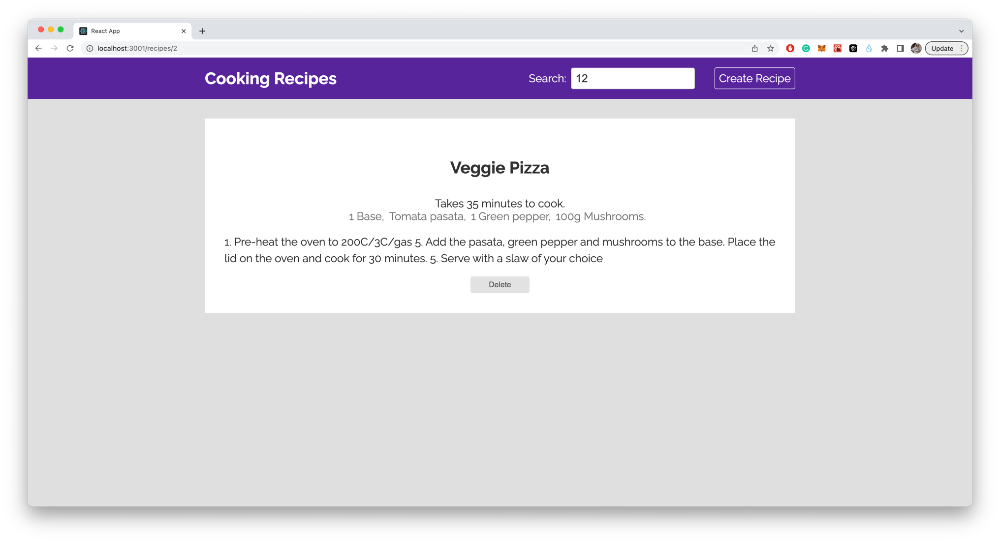

# Getting Started with Create React App

This project was bootstrapped with [Create React App](https://github.com/facebook/create-react-app).

## Available Scripts

In the project directory, you can run:

### `Project Setup`

```
npm install
npm install react-router-dom
npm install -g json-server
```
```
json-server --watch ./data/db.json
# Please open another terminal and type the below commmand
npm start
# Would you like to run the app on another port instead?
Y or yes
```


Runs the app in the development mode.\
Open [http://localhost:3001](http://localhost:3001) to view it in your browser.

The page will reload when you make changes.\
You may also see any lint errors in the console.

### `json-server`
Fetching the data from local `./data/db.json` and send http requests

## Feature
1. Recipe HomePage
   
2. Create Recipe
   
3. Recipe Detail Page
   
4. Delete Recipe
5. Search Results Page
   


Runs the app in the development mode.\
Open [http://localhost:3001](http://localhost:3001) to view it in your browser.

