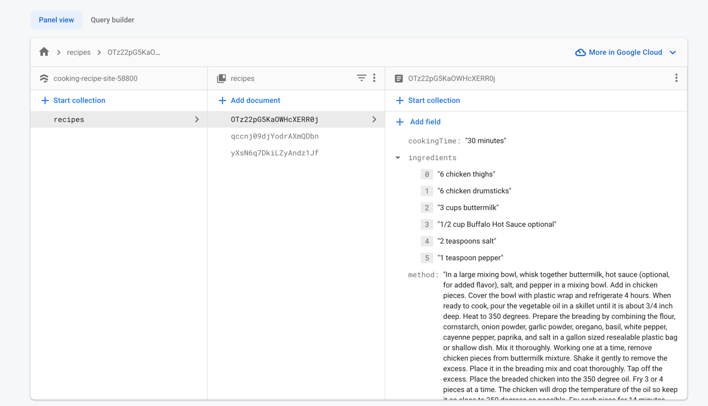
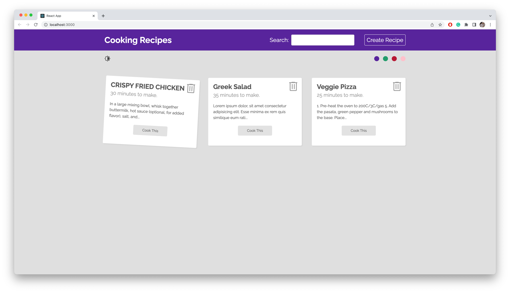
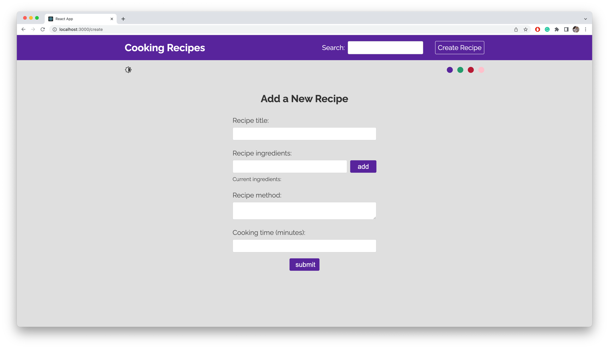
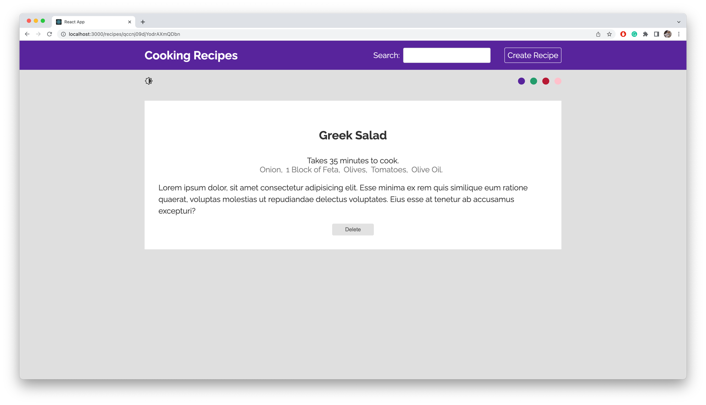
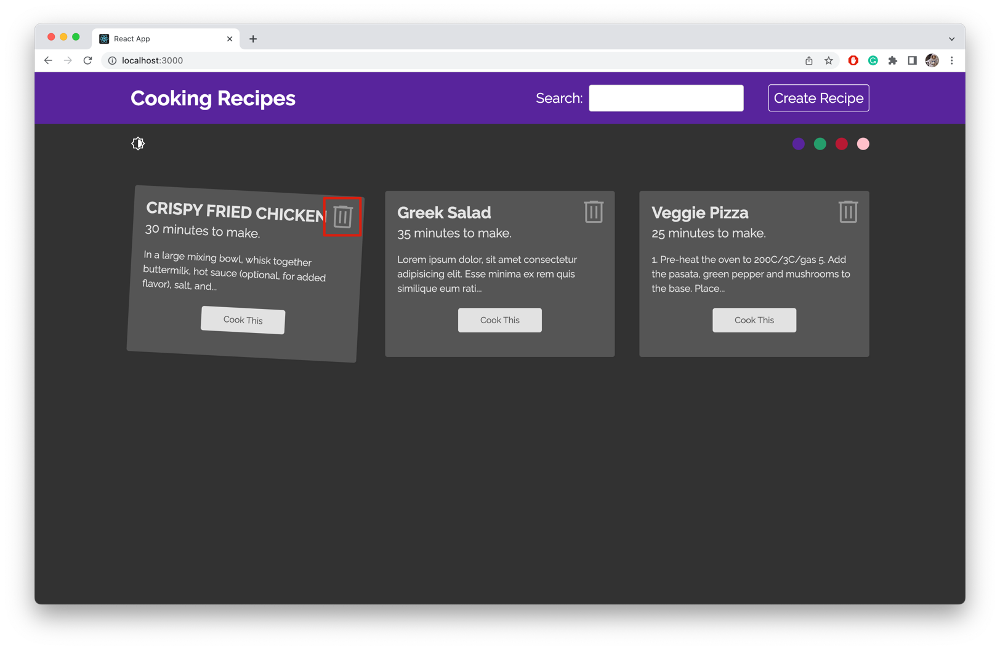
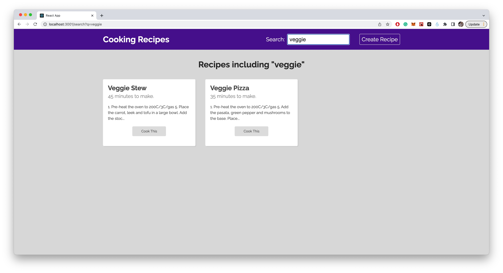
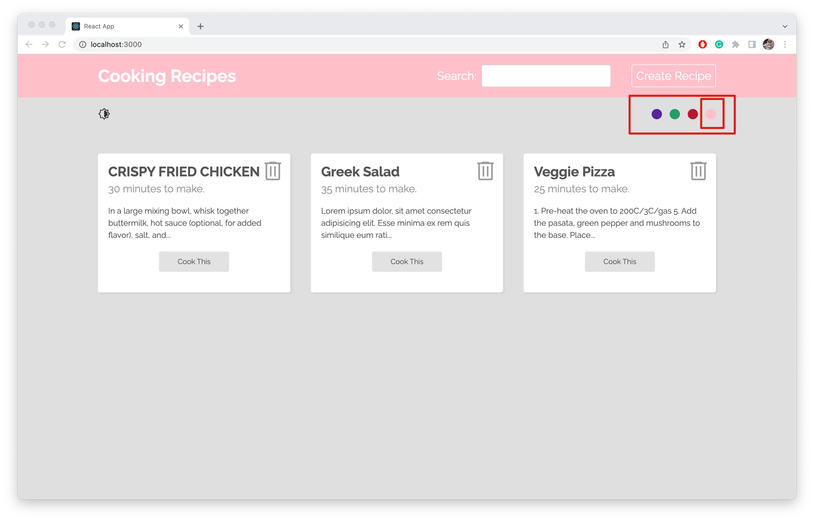
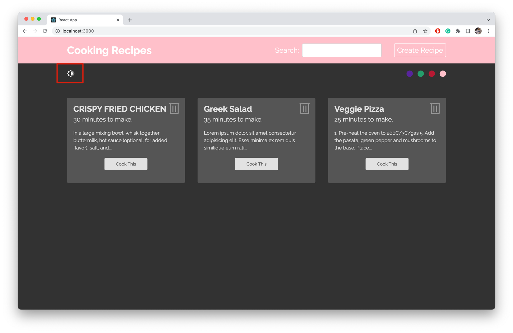

# Cooking Recipe

This project was bootstrapped with 
* FrontEnd - React
* BackEnd - Firebase
  * fetch/add/delete data

## Project Setup

In the project directory, you can run:


```
npm install
npm install react-router-dom
npm install firebase@8.5
npm start
```


Runs the app in the development mode.\
Open [http://localhost:3000](http://localhost:3000) to view it in your browser.

## Feature
1. FireBase Firestore Database
   
2. Recipe HomePage
   
3. Create Recipe
   
4. Recipe Detail Page
   
5. Delete Recipe
   
6. Search Results Page
   
7. Theme Selector
   
8. Dark/Light Mode
   

